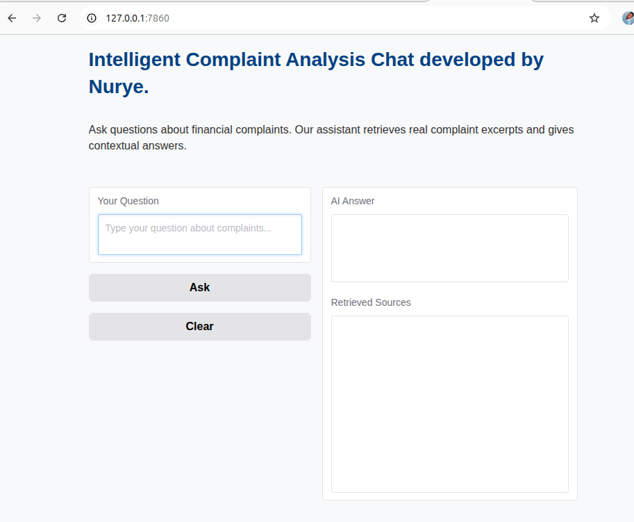
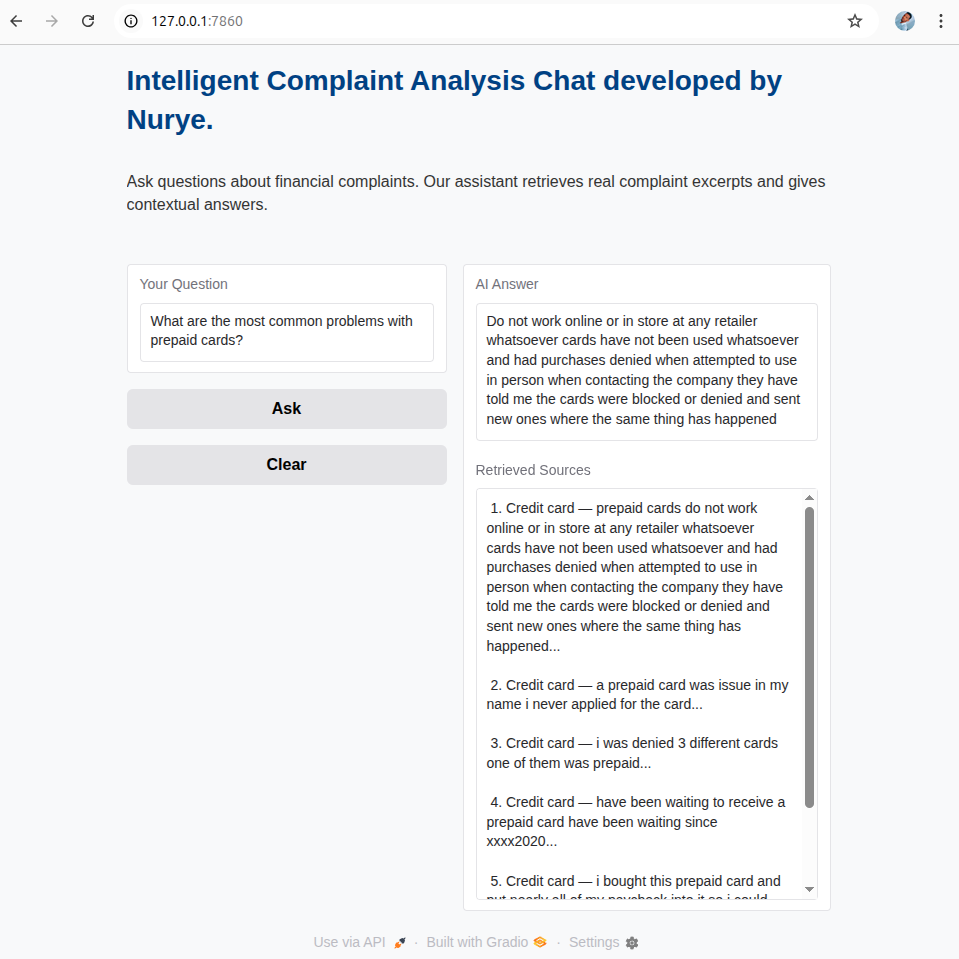

# Intelligent Complaint Analysis for Financial Services CrediTrust

## Project Overview

This project implements an AI-powered Retrieval-Augmented Generation (RAG) system to analyze, summarize, and answer questions about customer complaints related to financial products and services. The system combines advanced vector search with large language models (LLMs) to provide insightful, context-driven responses for business analysts and customer service teams.


## Business Value

- **Improved Customer Insights:** Quickly extract themes and common issues from thousands of customer complaints.  
- **Efficient Querying:** Non-technical stakeholders can ask natural language questions and get detailed, evidence-backed answers.  
- **Trust and Transparency:** The system shows exact source complaint excerpts used for generating answers, ensuring accountability.  
- **Faster Decision-Making:** Enables proactive problem-solving by surfacing critical complaints and trends with minimal manual effort.


## Project Structure

```

# Intelligent Complaint Analysis for Financial Services CrediTrust


##  Project Directory Structure

Intelligent-Complaint-Analysis-for-Financial-Services/
│
├── data/  
│   ├── complaints.csv                 # Raw customer complaint narratives
│   └── filtered_complaints.csv        # Cleaned and preprocessed complaints
│
├── vector_store/
│   ├── faiss_index.idx                # FAISS vector index for fast retrieval
│   └── metadata.pkl                   # Pickled metadata (chunk mappings, etc.)
│
├── outputs/
│   └── evaluation_report.md           # Model evaluation and performance summary
│
├── Notebook/
│   ├── embedding.ipynb                # Embedding & indexing notebook
│   ├── loading_cleaning.ipynb         # EDA + cleaning logic
│   ├── RAG.ipynb                      # RAG pipeline demonstration
│   └── plots/
│       ├── narrative_length_distribution.png
│       └── product_distribution.png   # Visualizations from EDA
│
├── Screenshoot/
│   ├── UI-before-asking.png
│   └── UI-after-answering.png         # Gradio app screenshots
│
├── src/                               # Core Python source files
│   ├── __init__.py
│   ├── data_preprocessing.py          # Text cleaning and chunking
│   ├── embedding.py                   # Embedding logic using SentenceTransformer
│   ├── retriever.py                   # FAISS retriever logic
│   ├── evaluate_rag.py                # RAG pipeline core logic
│   ├── evaluate_and_report.py         # Evaluation and reporting utilities
│   ├── rag_chat.py                    # Backend chat handling logic
│   ├── generator.py                   # Answer generation using LLM
│   └── prompt_template.py             # Prompt engineering and templates
│
├── app.py                             # Gradio-based web UI
├── README.md                          # Project overview and setup instructions
├── requirements.txt                   # Python dependencies
└── LICENSE                            # License file

```

## Setup and Installation

1. **Clone the repository**

   ```bash
   git clone https://github.com/NuryeNigusMekonen/Intelligent-Complaint-Analysis-for-Financial-Services.git
   cd Intelligent-Complaint-Analysis-for-Financial-Services
   ```

2. **Create and activate Python virtual environment**

   ```bash
   python3 -m venv CA-venv
   source CA-venv/bin/activate      # Linux/macOS
   CA-venv\Scripts\activate         # Windows
   ```

3. **Install required packages**

   ```bash
   pip install -r requirements.txt
   ```

4. **Prepare data**
 
 ```bash
Place the cleaned complaint dataset CSV (`filtered_complaints.csv`) in the `data/` folder.
```
---

## Usage

### 1. Build Vector Store (Embedding and Indexing)

Run the embedding script to chunk the complaint narratives and build the FAISS vector index:

```python
from src.embedding import create_vector_store

index, metadata = create_vector_store(
    input_path="data/filtered_complaints.csv",
    vector_dir="vector_store",
    chunk_size=5000,
    chunk_overlap=100,
    embedding_model_name="sentence-transformers/all-MiniLM-L6-v2",
    use_gpu=True,
    slice_size=5000
)
```

### 2. Evaluate RAG Pipeline and Generate Report

Run evaluation on a set of sample questions, generate answers with relevant complaint excerpts, and save a comprehensive Markdown report:

```python
from src.evaluate_and_report import evaluate_and_generate_report_auto

questions = [
    "How do customers feel about credit card late fees?",
    "Are there complaints about buy now, pay later?",
    "Is there dissatisfaction with student loans?",
    "What are the most common problems with prepaid cards?"
]

df_results = evaluate_and_generate_report_auto(
    questions,
    index_path="vector_store/faiss_index.idx",
    metadata_path="vector_store/metadata.pkl",
    output_path="outputs/evaluation_report.md",
    top_k=5
)

print(df_results.head())
```

### 3. Launch Interactive Chat Interface

Start the Gradio web app for non-technical users to ask questions interactively and receive AI-generated answers along with source complaint snippets:

```bash
python src/app.py
```

* Open the local URL provided (e.g., `http://127.0.0.1:7860`)
* Enter your questions in the text box
* View generated answers and source chunks displayed side-by-side
* Use the “Clear” button to reset the chat

---

## Evaluation and Insights

* The system was tested on a curated list of representative questions.
* The generated answers consistently reference relevant complaint excerpts to ensure traceability.
* Qualitative assessment reveals strengths in summarizing prevalent customer concerns and identifying complaint patterns.
* Opportunities for improvement include fine-tuning prompt engineering for more precise answers and exploring streaming responses for better UX.

---

## Future Work

* **Model Fine-Tuning:** Adapt LLMs on domain-specific complaint data for improved answer accuracy.
* **Real-Time Updates:** Incremental index updates to incorporate new complaints dynamically.
* **Multilingual Support:** Extend to analyze complaints in additional languages.
* **Advanced Analytics:** Integrate sentiment trend analysis and predictive modeling for complaint escalation.

---

## Screenshots

### Interactive Chat Interface

Here are screenshots from the app interface:





---

## Contact

For questions or collaboration opportunities, please contact:

**Nurye Nigus**
Email: [nurye.nigus.me@gmail.com](mailto:nurye.nigus.me@gmail.com)
LinkedIn: [linkedin.com/in/nryngs](https://linkedin.com/in/nryngs)

---

*Thank you for reviewing this project. We welcome feedback and contributions to improve the CrediTrust Complaint Analysis platform.*

