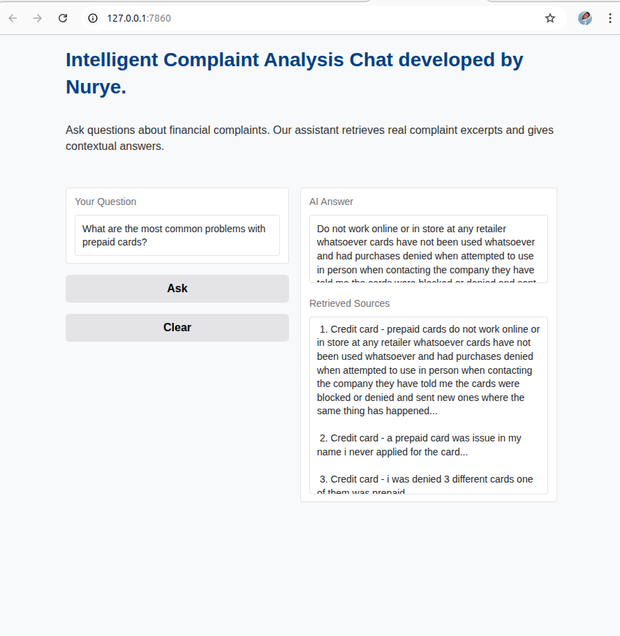

Absolutely! Here's a **clean, well-formatted, and ready-to-copy README.md** you can use — with proper blank lines around images and no markdown pitfalls that break image display on GitHub.

Make sure your image folder is really named `screanshoot` (as you said), and the images are named exactly `UI-before-asking.png` and `UI-after-answering.png` inside that folder.

---

```markdown
# Intelligent Complaint Analysis for Financial Services — CrediTrust

---

## Project Overview

This project implements an AI-powered Retrieval-Augmented Generation (RAG) system to analyze, summarize, and answer questions about customer complaints related to financial products and services. The system combines advanced vector search with large language models (LLMs) to provide insightful, context-driven responses for business analysts and customer service teams.

---

## Business Value

- **Improved Customer Insights:** Quickly extract themes and common issues from thousands of customer complaints.  
- **Efficient Querying:** Non-technical stakeholders can ask natural language questions and get detailed, evidence-backed answers.  
- **Trust and Transparency:** The system shows exact source complaint excerpts used for generating answers, ensuring accountability.  
- **Faster Decision-Making:** Enables proactive problem-solving by surfacing critical complaints and trends with minimal manual effort.

---

## Project Structure

```

project-root/
│
├── data/                         # Raw and cleaned complaint datasets (CSV)
├── vector\_store/                 # FAISS index and metadata pickle files
├── outputs/                      # Generated evaluation reports (Markdown)
├── src/                         # Source Python modules
│   ├── embedding.py              # Text chunking & embedding logic
│   ├── retriever.py              # Vector store loading and retrieval
│   ├── evaluate\_rag.py           # RAG pipeline core & evaluation
│   ├── evaluate\_and\_report.py    # Evaluation orchestration and report generation
│   ├── rag\_chat.py               # Interactive chat backend logic
│   ├── generator.py              # LLM prompt and generation utilities
│   ├── prompt\_template.py        # Prompt engineering templates
│   └── app.py                   # Gradio web app interface
│
├── README.md                     # This file — project overview & instructions
└── requirements.txt              # Project dependencies

````

---

## Setup and Installation

1. **Clone the repository**

   ```bash
   git clone <your-repo-url>
   cd <project-root>
````

2. **Create and activate Python virtual environment**

   ```bash
   python3 -m venv venv
   source venv/bin/activate      # Linux/macOS
   venv\Scripts\activate         # Windows
   ```

3. **Install required packages**

   ```bash
   pip install -r requirements.txt
   ```

4. **Prepare data**

Place the cleaned complaint dataset CSV (`filtered_complaints.csv`) in the `data/` folder.

---

## Usage

### 1. Build Vector Store (Embedding and Indexing)

Run the embedding script to chunk the complaint narratives and build the FAISS vector index:

```python
from src.embedding import create_vector_store

index, metadata = create_vector_store(
    input_path="data/filtered_complaints.csv",
    vector_dir="vector_store",
    chunk_size=5000,
    chunk_overlap=100,
    embedding_model_name="sentence-transformers/all-MiniLM-L6-v2",
    use_gpu=True,
    slice_size=5000
)
```

### 2. Evaluate RAG Pipeline and Generate Report

Run evaluation on a set of sample questions, generate answers with relevant complaint excerpts, and save a comprehensive Markdown report:

```python
from src.evaluate_and_report import evaluate_and_generate_report_auto

questions = [
    "How do customers feel about credit card late fees?",
    "Are there complaints about buy now, pay later?",
    "Is there dissatisfaction with student loans?",
    "What are the most common problems with prepaid cards?"
]

df_results = evaluate_and_generate_report_auto(
    questions,
    index_path="vector_store/faiss_index.idx",
    metadata_path="vector_store/metadata.pkl",
    output_path="outputs/evaluation_report.md",
    top_k=5
)

print(df_results.head())
```

### 3. Launch Interactive Chat Interface

Start the Gradio web app for non-technical users to ask questions interactively and receive AI-generated answers along with source complaint snippets:

```bash
python src/app.py
```

* Open the local URL provided (e.g., `http://127.0.0.1:7860`)
* Enter your questions in the text box
* View generated answers and source chunks displayed side-by-side
* Use the “Clear” button to reset the chat

---

## Evaluation and Insights

* The system was tested on a curated list of representative questions.
* The generated answers consistently reference relevant complaint excerpts to ensure traceability.
* Qualitative assessment reveals strengths in summarizing prevalent customer concerns and identifying complaint patterns.
* Opportunities for improvement include fine-tuning prompt engineering for more precise answers and exploring streaming responses for better UX.

---

## Future Work

* **Model Fine-Tuning:** Adapt LLMs on domain-specific complaint data for improved answer accuracy.
* **Real-Time Updates:** Incremental index updates to incorporate new complaints dynamically.
* **Multilingual Support:** Extend to analyze complaints in additional languages.
* **Advanced Analytics:** Integrate sentiment trend analysis and predictive modeling for complaint escalation.

---

## Screenshots

### Interactive Chat Interface

Here are screenshots from the app interface:




---

## Contact

For questions or collaboration opportunities, please contact:

**Nurye Nigus**
Email: [nurye.nigus.me@gmail.com](mailto:nurye.nigus.me@gmail.com)
LinkedIn: [linkedin.com/in/nryngs](https://linkedin.com/in/nryngs)

---

*Thank you for reviewing this project. We welcome feedback and contributions to improve the CrediTrust Complaint Analysis platform.*

```

---
